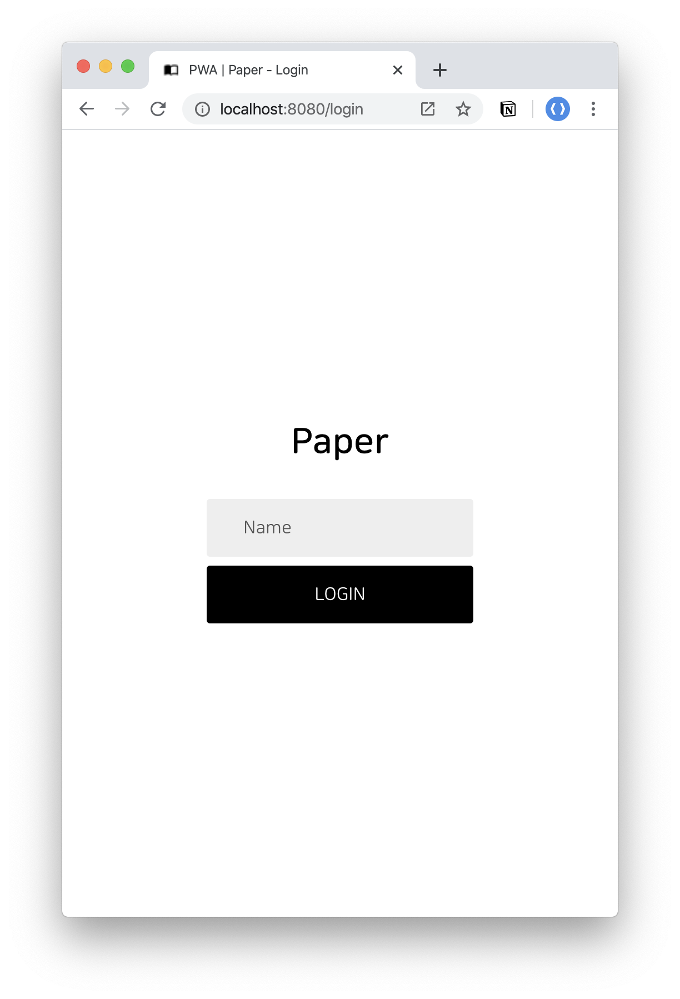
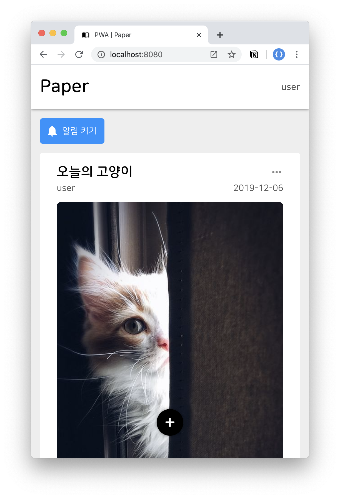
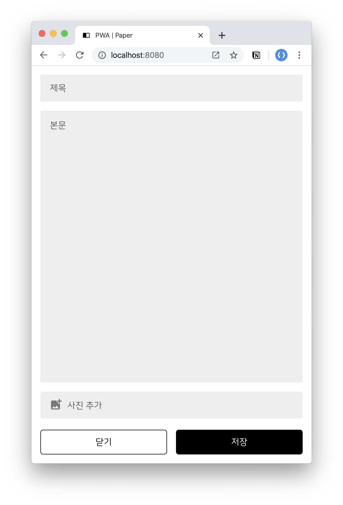
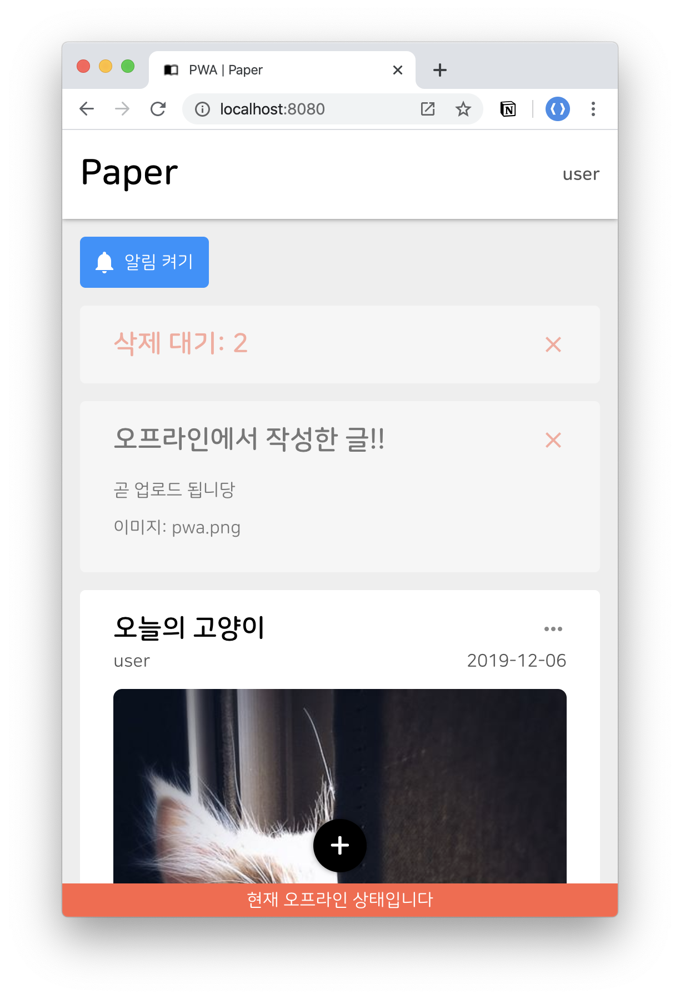
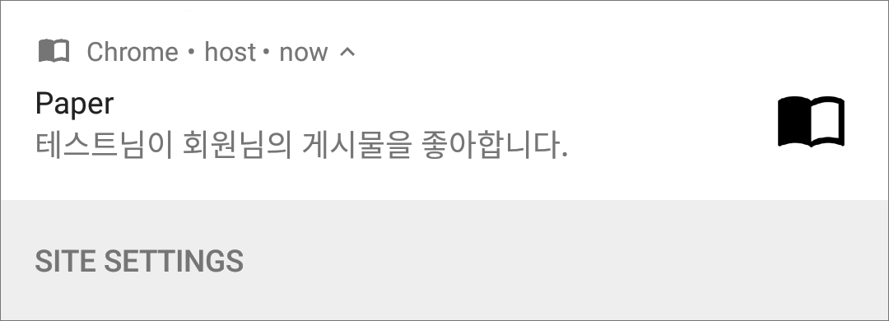
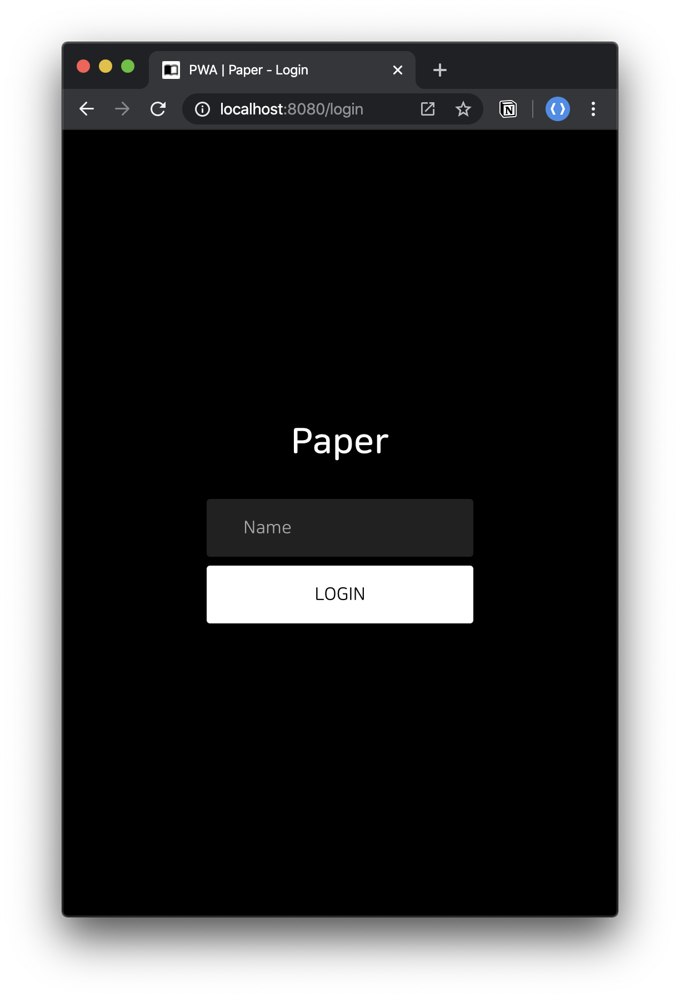

# Paper Guide

:page_facing_up: Paper 최종 모습 및 사용 가이드

## 사용자 인증

:closed_lock_with_key: 여러분이 원하는 이름을 입력하여 로그인할 수 있습니다.

## 게시물

- 게시물 조회 :eyes:
- 게시물 삭제 :x:
- 게시물 좋아요 :thumbsup:

## 게시물 작성

:pencil2: 언제든지 새로운 게시물을 작성할 수 있습니다.

## 오프라인 지원

:earth_americas::fire: 위의 모든 기능을 오프라인 환경에서 사용 가능합니다.

## 푸시 알림

:bell: 누군가가 여러분의 게시물에 좋아요를 눌렀다면, 푸시 알림으로 알려드립니다.

## 다크모드

:full_moon_with_face::new_moon_with_face: 사용자의 색상 테마에 따라 라이트모드/다크모드를 지원합니다.

